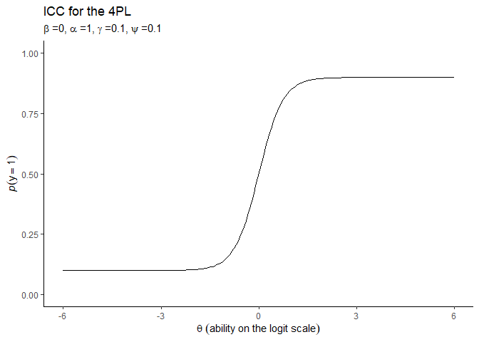
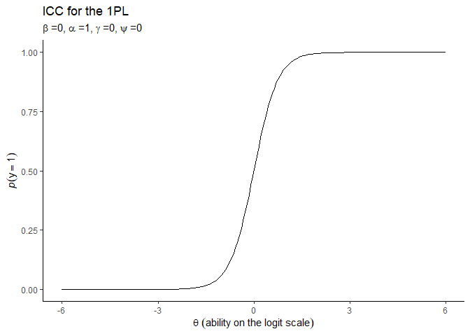
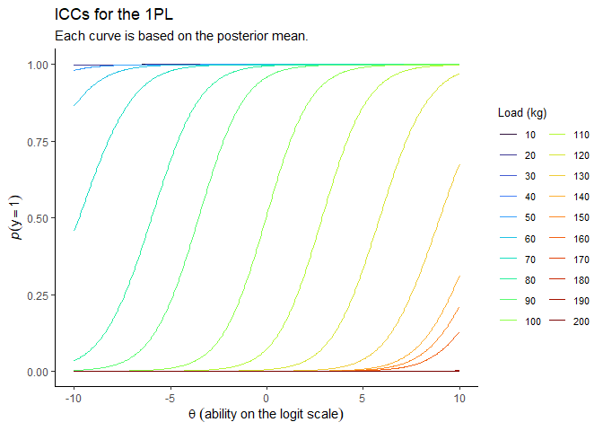
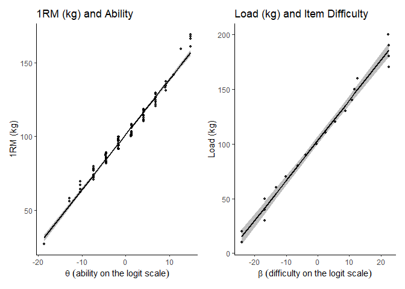

In my article titled [“What is (perception of) effort? Objective and
subjective effort during attempted task
performance”](https://www.hormelab.com/what_is_effort/) I offer clear
conceptual definitions of both *actual* effort (objective) and
*perception of* effort (subjective). Clear conceptual definitions are
key for determining whether a given operationalisation of those
definitions (i.e., our ways of defining those variables in the context
of our research) meet the necessary and sufficient conditions adequately
for the theoretical unit of interest.

In this post I will attempt to provide a solution for a problem I have
thought about for a while; namely, how best to operationalise actual
effort in cognitive tasks. As I will explain, unlike many physical tasks
where operationalisation is fairly trivial, it is not quite so simple to
do so for tasks where the underlying capacity that disposes an
individual to be able to attempt and perhaps complete the task is not
directly observable nor is the demand that the task presents.

However, I think that a solution might lie in the measurement theory
employed in psychometrics known as Item Response Theory (IRT). Some of
it’s key assumptions and the parameters of its models map conceptually
well to those underlying my definition of actual effort. First though,
let’s review my definition for context

### *Conceptual definition of actual effort*

I define actual effort as follows:

> “Effort; *noun*; That which must be done in attempting to meet a
> particular task demand, or set of task demands, and which is
> determined by the current task demands relative to capacity to meet
> those demands, though cannot exceed that current capacity.”

And more specifically following Markus’[1] Set Theoretical approach
as[2]:

> “Effort (concept);
> *E**A*(*j*, *t*, *C**A*, *D**A*, *w*, *T**A**n**y*)
> is the actual effort for any individual *j* at time *t* where
> *C**A*(*j*, *t*, *x**C*), and
> *D**A*(*i*, *t*, *x**D*) are the actual capacity
> and actual demands respectively, and *x**C* and
> *x**D* are the magnitudes of those respectively for
> individual *j* at time *t*, where *w* denotes all possible states of
> affairs (i.e. combinations of *j*, *t*, *C**A*, and
> *D**A*), and *T**A**n**y* denotes the boundary
> conditions noting it as intensional to all possible types of tasks.”

And which is expressed as a derived ratio, given that capacity and
demands have natural origins (capacity can be zero, as can demands, but
neither can be less than zero):

$$D\_{A} \\leq C\_{A} \\Rightarrow E\_{A} = \\frac{ 
    D\_{A}}
{C\_{A}} \\times 100%$$

*D**A* &gt; *C**A* ⇒ *E**A* = 100

Where the ratio is expressed as a percentage (%).

Now, the *T**A**n**y* argument is important for what I am
about to present. The conceptual definitions I have developed are
deliberately agnostic of the type of task being performed. However, it’s
not that easy to apply the definition to all kinds of tasks given that
in many we haven’t got good operationalisations of *C**A* and
*D**A*. Sure, for tasks typical to my alma mater of research,
resistance training, it’s pretty simple. Take a physical task such as
this, in essence lifting a weight… here’s how I gave an example of the
definition in play:

> “In a physical task the role of differential demands and capacity are
> easily considered in that actual effort is determined by the task
> demands relative to the current capacity to meet task demands. As
> such, if two individuals were attempting to pick up the same specific
> absolute load (e.g. 80 kg) the stronger of the two would initially
> require less actual effort to complete this task. If they had both
> performed prior tasks that had resulted in a reduction in their
> maximal strength, then each would require a greater actual effort to
> complete the task than compared with when their capacity was not
> reduced. And further, if both continued performing repetitions of this
> task their maximal strength might continue to reduce insidious to
> continued attempts to maintain a particular absolute demand, and thus
> require an increasingly greater actual effort with every individual or
> continued attempt to meet the task demands. Correspondingly, if the
> absolute task demands were increased then both individuals would also
> require greater actual effort to complete the task. Yet for both, the
> continued attempted performance of the task with fixed absolute
> demands and insidious reduction of capacity or the increase of
> absolute demands, task performance would be capped by their maximum
> capacity at which maximum effort is required. With training though
> that maximum strength might be increased such that a given absolute
> task demand now represents relatively less and so requires less actual
> effort. Further, biomechanical alterations to the task might reduce
> the absolute demands and thus the actual effort.”

So, let’s say an individual (*j*) did try to lift a load (*i*) that was
80 kg. And let’s say that the maximum load they could lift was 100 kg.
Well, it’s pretty simple to calculate the actual effort required:

*D**A*(*i*) = 80, *C**A*(*j*) = 100
$$E\_{A(ji)} = \\frac{ 
D\_{A(i)}}
{C\_{A(j)}} \\times 100%$$
$$\\ 80 = \\frac{ 
80}
{100} \\times 100$$

So, the amount of actual effort required by the individual to lift the
load is 80%. Nice and simple.

But what about cognitive tasks? Sure, we can conceivably apply my
definition to such tasks if we assume that such tasks present demands
that must be met, and that we have some capacity to meet them. In fact,
we could draw similar examples as above for such tasks… again, here’s
what I note:

> “Similar examples could be provided for cognitive tasks. For example,
> if two individuals were attempting to hold a fixed number of items in
> their working memory, the one who has the larger working memory of the
> two would require less actual effort to complete this task. However,
> both individuals would again require greater actual effort to do so in
> the presence of lingering reduction in cognitive capacity from prior
> tasks, or from continued attempts to meet the task demands, or from
> increased absolute task demands (i.e., more items to be held in
> working memory). Again, training may also improve maximal capacity.
> Also, cognitive processing alterations (i.e., heuristics; Shah and
> Oppenheimer, 2008) might reduce task demands and thus the actual
> effort.”

The problem however, is actually measuring the capacity being used to
perform cognitive tasks, and the demands of those tasks. It’s not as
simple as with say strength or the load lifted. We have an
operationalisation problem for cognitive tasks.

But, as noted, I think the trick to this problem might lie in IRT.

### *Item Response Theory*

For those unfamiliar with IRT, I’ll provide a very brief overview of
some key elements that are relevant for this post. But otherwise there
are plenty of great texts out there covering its background and history,
differences with Classical Test Theory, assumptions, different model
types and parameters, how these are estimated, model fit etc[3].

Let’s suppose that, for each person we test *j*(*j* = 1, ..., *J*), and
each item in a test they complete *i*(*i* = 1, ..., *I*), we have a
binary response *y**j**i* which is coded 1 for a correct
answer (i.e., success), and 0 for an incorrect answer (i.e., failure). A
binary IRT model aims to model
*p**j**i* = *P*(*y**j**i* = 1); in essence the
probability that a person *j* correctly answers item *i* which is
assumed to follow a Bernoulli distribution:

 *y**j**i* ∼ *B**e**r**n**o**u**l**l**i*(*p**j**i*)

A key aspect of IRT is that, as a theory, it posits links between some
construct that is a characteristic of an individual, referred to as a
*trait* or *ability*, and that an individuals performance in a test of
that ability are predicted or explained by that ability. However, we
can’t directly observe this ability itself and instead must infer an
estimation of it from the observation of performance on the test. For
this reason the abilities are often referred to as *latent*. The
relationship between the “observable” and “unobservable” is then
described by a mathematical function which are models that make specific
assumptions about the test data; different models imply different
assumptions one is willing to make about the test data being examined
given the nature of the test conducted. For example, a recently popular
model due to its flexibility is the four-parameter logistic model (4PL)
where *P*(*y**j**i* = 1) is expressed through the equation:

$$\\ P(y\_{ji}=1)=\\gamma+(1-\\gamma\_{i}-\\psi\_{i}) \\frac{
1}{1+exp(-(\\alpha\_{i}\\theta\_{j}-\\beta\_{i}))}$$

In this model there are four key parameters as the name suggests, which
reflect the assumptions about the test data. The *β**i*
parameter describes the item location which depending on the sign
direction people prefer can refer to either the ‘difficulty’ or the
‘easiness’ of the item[4]. The *α**i* parameter refers to how
strongly an item is related to the latent ability *θ**j*
which is typically positive (i.e., that answering correctly typically
implies higher ability than if answering incorrectly).The parameters
*γ**i* and *ψ**i* refer to the guessing
probability (i.e., that the correct answer on an item could be guessed
and not due to ability), and a lapse probability respectively (i.e.,
that a person could make a mistake, press the wrong key etc. despite
actually knowing the correct answer).

An Item Characteristic Curve (ICC) is usually used to visualise the
relationship between ability and the probability of a correct response
to items. So for example, a 4PL model might look something like:

Different models make different assumptions about these parameters. For
example, the simplest one-parameter logistic model (1PL or Rasch model)
assumes that *α* = 1 and both *γ* = 0 and *ψ* = 0; that is to say, items
discriminate between higher and lower abilities equally well and there
is no guessing or lapses occurring. A model of that kind might look
like:

In general though, the application of an IRT model allows for test data
to be decomposed into an estimate of the characteristic of the
individual (i.e., their *ability*, *θ**j*). For my purpose
today though, the other parameter of such models that is of primary
iterest is the estimates of the test items location (i.e., their
*difficulty*, *β**i*).

That’s about as detailed as I am going to get for the purpose of this
post. The point I want to make is more conceptual… or at least, it is
more about exploring whether or not we can use IRT models as a means of
operationalising *C**A*(*j*) and *D**A*(*i*) in
order to operationalise calculation of *E**A*(*j**i*) under
cognitive tasks.

### *Ability = Capacity (*θ**j* = *C**A*(*j*)); Difficulty = Demands (*β**i* = *D**A*(*i*))*

In essence, the argument I am putting forward here is that the two
primitives *C**A* and *D**A* I have assumed are
necessary and sufficient for the derivation of the concept
*E**A* are exactly what IRT takes as its own underlying
assumed constructs; namely *θ* and *β* respectively.

So I think that we can use IRT models in order to estimate these
parameters and then use them to calculate an estimate of the
*E**A* required for each individual as they attempt each
item. That is to say, we can take our function for *E**A*
above and say:

$$\\beta \\leq \\theta \\Rightarrow E\_{A(IRT)} = \\frac{ 
    \\beta}
{\\theta} \\times 100%$$

*β* &gt; *θ* ⇒ *E**A*(*I**R**T*) = 100
Where the IRT subscript denotes that it is estimated from the IRT model.

However, those who are familiar with typical IRT models might notice a
problem here for my proposed solution to operationalisation; *β* and *θ*
are typically estimated on the *l**o**g**i**t* scale which ranges
 − ∞, ∞. This poses some problems for us when it comes to calculating
*E**A* given it is a ratio and the *l**o**g**i**t* scale does
not have ratio properties.

Fortunately, the choice of which scale to place *β* and *θ* on is rather
arbitrary. Most common IRT models can undergo transformations from the
*l**o**g**i**t* scale that both preserves the underlying probabilities
for a given *θ* completing a given item with difficulty *β*. For
example, the 1PL model can undergo linear transformation without
altering the underlying mathematical model and we can have
*θ**t**r**a**n**s**f* and *β**t**r**a**n**s**f*.
So this gave me an idea, a toy example of sorts, to explore whether or
not the derivation of effort from an IRT type model would provide a good
estimate of the actual effort resultant from the demands of the task
items, and the latent ability of the person performing them.

### *Using IRT models for lifting weights*

I’m a fan of analogical abduction. I used it in developing my conceptual
definition of effort in the first place. So I’m going to use the analogy
of a test of the ability ‘strength’ where an individual attempts to lift
different loads. In resistance training, it is pretty common to measure
strength this way. We perform what is referred to as a *one-repetition
maximum* (1RM) test. This test is the operationalisation of strength
through the capacity to lift load in a given exercise task. Normally, an
individual would perform a warmup, and then lift progressively heavier
and heavier loads[5] until the heaviest load they could lift only once,
and no more, was identified. If we know the maximum load that an
individual can lift once, then it’s a good assumption to think that this
means they can also lift any load weighing less than this. If their 1RM
was 100 kg and we asked them to lift 50 kg they’d almost certainly be
able to. If we asked them to lift 90 kg, whilst it would be a lot more
demanding to do so, they’d still almost certainly be able to do so. But
if we asked them to lift 110 kg they’d almost certainly not be able to
do so.

Given that the outcome of attempting to lift a given load can be
considered in a binary manner (that is to say a person either can, or
cannot, lift the load given their strength ability), whilst unusual to
do so, we could fit an IRT model to such data. This offers an
interesting toy example to play with where we could actually have a
directly *measurable ability* (*strength*; *C**A*(*j*)), and
also can directly *measure item difficulty* (*loads*;
*D**A*(*i*)). So we can directly calculate
*E**A*(*j*) from such data. If we also fit an IRT model,
transform the estimates of *θ**j* and *β**i* back
to the raw scale (i.e., kg; *θ**t**r**a**n**s**f* and
*β**t**r**a**n**s**f*), we can then also calculate an
estimate of actual effort based on the model
(*E**A*(*j*, *I**R**T*)).

Let’s simulate some data[6] and see what it looks like. We
sample *n* = 100 individuals from a population with a 1RM for the
exercise task of *μ* = 100 kg and *s**d* = 25 kg, which is pretty
reasonable for such a measure. We’ll say that each individual completes
twenty ‘items’, which in this case means they attempt to lift twenty
different loads, ranging from 10 kg to 200 kg in 10 kg intervals. Given
we know their strength (i.e., *C**A*(*j*)) and the load they
are trying to lift (i.e., *D**A*(*j*)) we can calculate their
actual effort (i.e., *E**A*(*j**i*)). Further, we can also
code for their binary ‘response’ to each load; that is to say, whether
they successfully lift it or not. This is determined by their strength,
the same way that response to items in IRT models is assumed to be
determined by the latent ability. In this case though, we know for
certain whether they can or can’t lift the load given we actually know
their 1RM. So we simply code 1 if 1RM is greater than or equal to the
load, and 0 if 1RM is less than the load.

An example of data for an individual showing the first 10 loads looks
like this[7]:

    ## # A tibble: 10 x 5
    ##    person one_RM item  actual_effort response
    ##    <fct>   <dbl> <fct>         <dbl>    <dbl>
    ##  1 p002     91.5 10             10.9        1
    ##  2 p002     91.5 20             21.8        1
    ##  3 p002     91.5 30             32.8        1
    ##  4 p002     91.5 40             43.7        1
    ##  5 p002     91.5 50             54.6        1
    ##  6 p002     91.5 60             65.5        1
    ##  7 p002     91.5 70             76.5        1
    ##  8 p002     91.5 80             87.4        1
    ##  9 p002     91.5 90             98.3        1
    ## 10 p002     91.5 100           100          0

Now, given the kind of test completed here (i.e., lifting different
loads) it is reasonable to use the 1PL model mentioned above because
there is no guessing or lapsing, nor do different items differentiate
people of different abilities differently (it’s a toy example so we’re
building these assumptions in). I’m going to follow an approach using
Bayesian mixed effect modelling using weakly regularising priors to fit
the initial 1PL model using the {brms} package which I won’t go into
detail about here[8]. I’ll use Bayesian models for the following parts
also with default priors to keep the approach consistent.

So we fit the 1PL model and we can plot the ICCs[9] for each load which
look like this:

So it’s pretty clear that the model recognises that people are more
likely to lift lighter loads than heavier loads, and that people with a
greater strength ability are also more likely to lift a given load. We
do have some loads though that are just incredibly easy such that pretty
much anyone can lift them, and conversely so incredible difficult that
no one can lift them.

After we fit the 1PL model we we can then extract the random effects by
person and item, namely *θ**j* and *β**i*. What we
want to do is examine their relationship with the ‘measured’ raw 1RM and
loads respectively so we can determine the linear transformation needed
to convert *θ**j* and *β**i* back to the raw kg
units *θ**j*(*t**r**a**n**s**f*) and
*β**i*(*t**r**a**n**s**f*).

So we fit a simple linear model to estimate 1RM from *θ**j*:

    lm_1RM

    ##  Family: gaussian 
    ##   Links: mu = identity; sigma = identity 
    ## Formula: one_RM ~ theta 
    ##    Data: scores_oneRM (Number of observations: 100) 
    ## Samples: 4 chains, each with iter = 2000; warmup = 1000; thin = 1;
    ##          total post-warmup samples = 4000
    ## 
    ## Population-Level Effects: 
    ##           Estimate Est.Error l-95% CI u-95% CI Rhat Bulk_ESS Tail_ESS
    ## Intercept   101.43      0.39   100.66   102.18 1.00     4144     3028
    ## theta         3.75      0.06     3.63     3.87 1.00     4011     2628
    ## 
    ## Family Specific Parameters: 
    ##       Estimate Est.Error l-95% CI u-95% CI Rhat Bulk_ESS Tail_ESS
    ## sigma     4.03      0.29     3.50     4.64 1.00     3763     2942
    ## 
    ## Samples were drawn using sampling(NUTS). For each parameter, Bulk_ESS
    ## and Tail_ESS are effective sample size measures, and Rhat is the potential
    ## scale reduction factor on split chains (at convergence, Rhat = 1).

And also to estimate load from *β**i*:

    lm_loads

    ##  Family: gaussian 
    ##   Links: mu = identity; sigma = identity 
    ## Formula: load ~ beta 
    ##    Data: loads (Number of observations: 20) 
    ## Samples: 4 chains, each with iter = 2000; warmup = 1000; thin = 1;
    ##          total post-warmup samples = 4000
    ## 
    ## Population-Level Effects: 
    ##           Estimate Est.Error l-95% CI u-95% CI Rhat Bulk_ESS Tail_ESS
    ## Intercept   103.20      1.80    99.69   106.80 1.00     3204     2433
    ## beta          3.66      0.12     3.43     3.90 1.00     3275     2238
    ## 
    ## Family Specific Parameters: 
    ##       Estimate Est.Error l-95% CI u-95% CI Rhat Bulk_ESS Tail_ESS
    ## sigma     7.99      1.54     5.68    11.57 1.00     2608     2275
    ## 
    ## Samples were drawn using sampling(NUTS). For each parameter, Bulk_ESS
    ## and Tail_ESS are effective sample size measures, and Rhat is the potential
    ## scale reduction factor on split chains (at convergence, Rhat = 1).

And visually the fit looks like this:

So, we can now use the intercepts and coefficients from these models to
linearly transform *θ**j* and *β**i* back to the
raw kg units *θ**j*(*t**r**a**n**s**f*) and
*β**i*(*t**r**a**n**s**f*). Then we can use them to calculate
our IRT model estimate of actual effort as:

$$\\beta\_{i(transf)} \\leq \\theta\_{j(transf)} \\Rightarrow E\_{A(ji,IRT)} = \\frac{ 
    \\beta\_{i(transf)}}
{\\theta\_{j(transf)}} \\times 100%$$

*β**i*(*t**r**a**n**s**f*) &gt; *θ**j*(*t**r**a**n**s**f*) ⇒ *E**A*, (*j**i*, *I**R**T*) = 100

Now we have two sets of actual effort in our dataset; we have the
original actual effort calculated directly from the 1RM and loads
(*E**A*(*j**i*)) and also and effort calculated from our
transformed estimates of ability and difficulty
(*E**A*(*j**i*, *I**R**T*)).

    ##    person   one_RM item actual_effort    theta        beta theta_to_raw
    ## 1    p001 103.3932   10      9.671814 1.285345 -24.0017328     106.2456
    ## 2    p001 103.3932   20     19.343628 1.285345 -23.9618068     106.2456
    ## 3    p001 103.3932   30     29.015442 1.285345 -16.7967155     106.2456
    ## 4    p001 103.3932   40     38.687256 1.285345 -16.8287655     106.2456
    ## 5    p001 103.3932   50     48.359070 1.285345 -16.8338692     106.2456
    ## 6    p001 103.3932   60     58.030884 1.285345 -13.1635832     106.2456
    ## 7    p001 103.3932   70     67.702698 1.285345 -10.0809491     106.2456
    ## 8    p001 103.3932   80     77.374512 1.285345  -6.2924263     106.2456
    ## 9    p001 103.3932   90     87.046326 1.285345  -3.8389369     106.2456
    ## 10   p001 103.3932  100     96.718140 1.285345  -0.3236282     106.2456
    ##    beta_to_raw irt_effort
    ## 1     15.27550   14.37754
    ## 2     15.42177   14.51521
    ## 3     41.67062   39.22105
    ## 4     41.55321   39.11054
    ## 5     41.53451   39.09294
    ## 6     54.98037   51.74839
    ## 7     66.27340   62.37758
    ## 8     80.15241   75.44072
    ## 9     89.14061   83.90056
    ## 10   102.01872   96.02164

Now, because we have multiple observations for each individuals we can
fit a mixed effects model with random intercepts and slopes to explore
how well the *E**A*(*j**i*, *I**R**T*) estimates
*E**A*(*j**i*). Given the conceptualisation of effort as
being a bounded construct on the 0% to 100% interval we should use a
model taking that into account and so we fit an ordered beta regression
model[10].

This doesn’t look too bad to be fair. In fact, while it slightly
underestimates at the lower bounds, it’s pretty darn good in my opinion
and leaves me feeling fairly confident in using
*E**A*(*j**i*, *I**R**T*) as my operationalisation for
*E**A*(*j**i*).

### *Summary and Conclusion*

Key assumptions underlying IRT models and their parameters, *ability*
and *difficulty*, map conceptually well onto the assumed primitives,
*capacity* and *demands*, in my definition of effort. Given this, IRT
models seem like a useful approach to operationalisation of *actual
effort* in cognitive tasks. In fact, using the example of a test
involving lifting weights where we actually know a persons underlying
ability/capacity and the difficulty/demands of each item in the test,
the estimates of effort that result from an IRT model are pretty
reasonable estimates of the actual effort we could calculate from direct
measurements.

I think this approach offers an interesting opportunity to look at
actual effort in cognitive tasks. This could be particularly useful in
exploring psychophysics in such tasks where we also capture self-reports
of perception of effort during each item.

Further, I do not think that such models are limited to only cognitive
tasks. As I have shown here, we can apply IRT models to tasks we
wouldn’t typically think to. Many people have been thwarted in attempts
to conceptualise effort in target based tasks such as dart throwing.
However, I think that the use of IRT models could also allow the
estimation of actual effort for these tasks.

[1] Markus, K. A. (2008). Constructs, concepts and the worlds of
possibility: Connecting the measurement, manipulation, and meaning of
variables. Measurement: Interdisciplinary Research and Perspectives,
6(1-2), 54–77. <https://doi.org/10.1080/15366360802035513>

[2] I’ll use*j* here to denote the individual instead of*i* as I do in
the original paper, to be in keeping with the typical notation used in
Item Response Theory models that follows because *i* is used for the
‘item’.

[3] To be fair, the [Wikipedia
page](https://en.wikipedia.org/wiki/Item_response_theory) on IRT
provides a pretty good overview as expected. But I do like Fundamentals
of Item Response Theory by R. K. Hambleton, H. Swaminathan, and H. J.
Rogers as a strong intro text that’s pretty short (only ~150 pages
excluding appendices etc.)

[4] Note, for my purposes here I am going with the ‘difficulty’, but if
we wanted ‘easiness’ we would use
*α**i**θ**j* + *β**i*.

[5] For those unfamiliar, in practice this is normally achieved within
3-5 attempts so as to not allow cumulative fatigue to unduly influence
the estimate of maximum strength.

[6] I used Lisa DeBruine’s great package {faux} for this, which I tend
to use for a lot of simulation as it’s so intuitive. Check it out
[here](https://debruine.github.io/faux/).

[7] I’ve deliberately chose someone with a 1RM &lt; 100 kg so it’s clear
that the response is dependent on the relationship between that and the
load lifted.

[8] But, take a look at at the great papers by by Paul Bürkner
[here](https://arxiv.org/abs/1905.09501) and
[here](https://www.mdpi.com/2079-3200/8/1/5/htm) who authored the {brms}
package - see [here](https://www.jstatsoft.org/article/view/v080i01).

[9] Credit to Solomon Kurz for his great
[post](https://solomonkurz.netlify.app/post/2021-06-29-make-icc-plots-for-your-brms-irt-models/)
on wrangling {brms} models to create these ICC plots.

[10] Nice paper on this recently developed approach to handling bounded
variables, along with the {ordbetareg} package that overlays {brms},
from Robert Kubinec [here](https://osf.io/preprints/socarxiv/2sx6y/)
